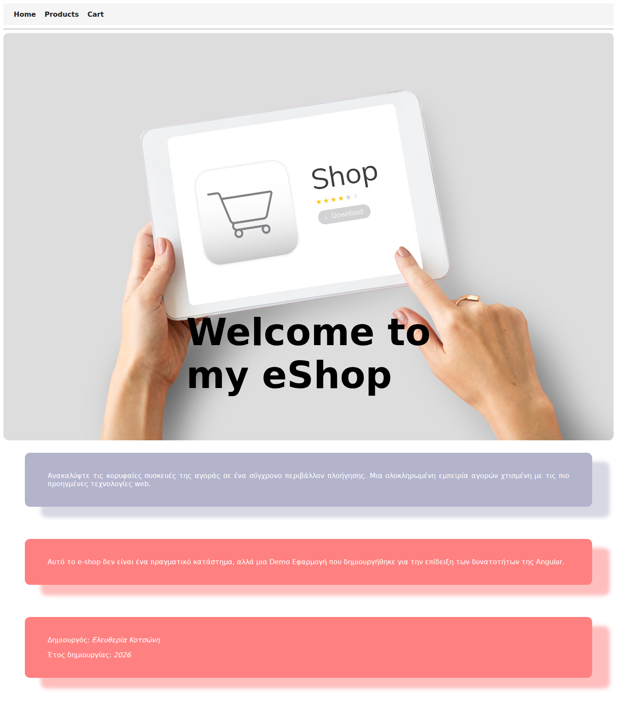

# Angular eShop Demo

A responsive front-end e-commerce demo built with Angular. The project focuses on component-based architecture, client-side routing, shared cart state and responsive layouts.

> This is a portfolio and learning project. It does not process real orders or payments.

## Live demo

[View the application on GitHub Pages](https://ekotsoni-3w.github.io/angular-eshop-demo/)




## Features

- Product catalogue with responsive cards
- Dedicated product-detail routes
- Add-to-cart functionality with quantity aggregation
- Live cart item counter in the navigation
- Cart summary, total calculation and item removal
- Responsive layouts for desktop, tablet and mobile
- Prerendered routes for static hosting
- Unit tests with Vitest

## Built with

- Angular 21
- TypeScript
- Angular Router
- HTML and CSS
- Vitest

## Run locally

Requirements: Node.js 20.19+ and npm.

```bash
git clone https://github.com/ekotsoni-3w/angular-eshop-demo.git
cd angular-eshop-demo
npm ci
npm start
```

Open `http://localhost:4200/` in your browser.

## Quality checks

```bash
npm run build
npm run test:ci
```

## Project structure

```text
src/app/
├── cart/               # Cart page
├── home/               # Landing page
├── product-details/    # Individual product view
├── products/           # Product catalogue
├── app.routes.ts       # Client-side routes
└── cart.ts             # Shared cart service
```

## What I practised

- Building standalone Angular components
- Configuring parameterised routes
- Sharing state through dependency injection
- Using Angular template control flow (`@if` and `@for`)
- Testing routed components
- Preparing an Angular app for static deployment

## Current scope

Product data and cart state are stored in memory. Refreshing the page resets the cart. Authentication, checkout, payments, a back end and a database are intentionally outside the scope of this demo.

## Author

Created by **Eleftheria Kotsoni** in 2026.

## Image credits

Images are sourced from [Pixabay](https://pixabay.com/) and used under the Pixabay Content License.

## Usage

The source code is publicly visible for portfolio review. All rights reserved; reuse or redistribution requires permission.
