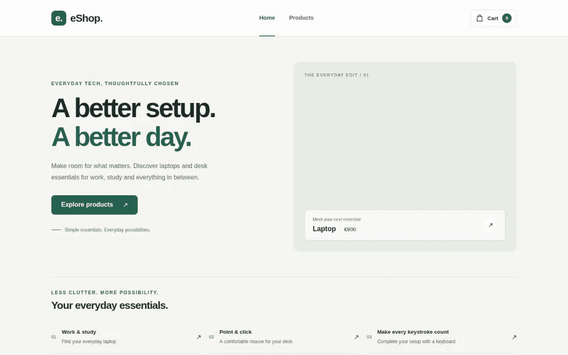
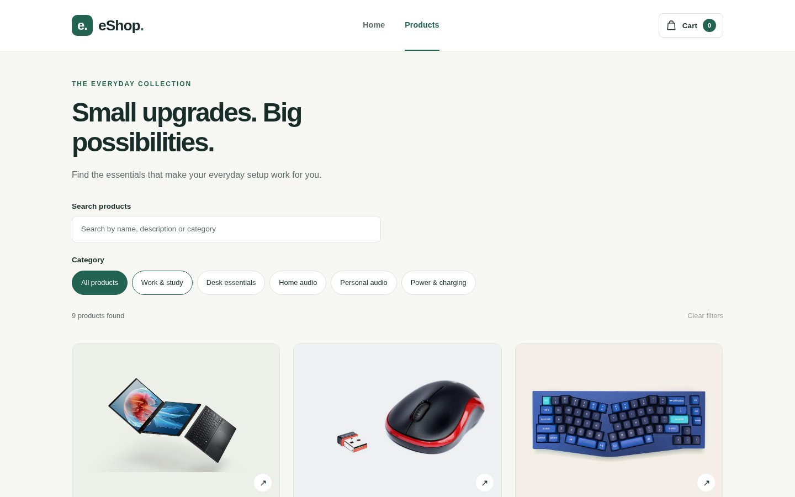
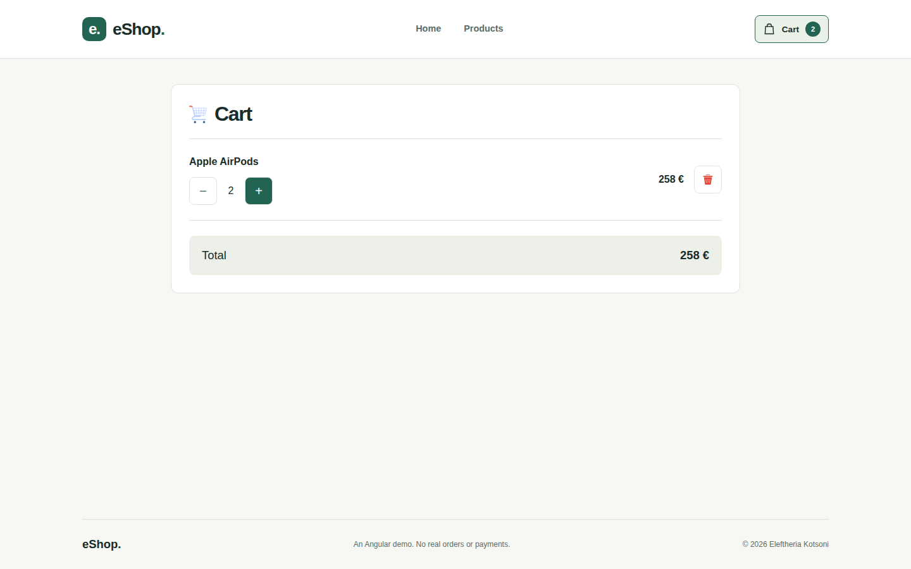
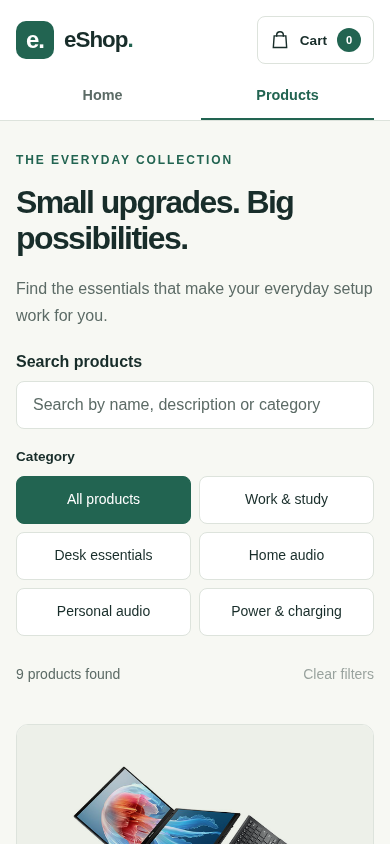

# Angular eShop

A responsive front-end e-commerce experience built with Angular 21 and TypeScript. It demonstrates a complete browse-to-cart flow with reusable product data, client-side routing, combined search and filtering, persistent cart state, responsive layouts and automated tests.

[](https://angular.dev/)
[](https://www.typescriptlang.org/)
[](#testing)
[](https://github.com/ekotsoni-3w/angular-eshop-demo/actions/workflows/deploy-pages.yml)

**[View the live application](https://ekotsoni-3w.github.io/angular-eshop-demo/)**

> Portfolio demo only. It does not process real orders or payments.

## Demo



## Highlights

- Nine-product catalogue backed by a single typed data source
- Search across product name, description and category
- Category filters that combine with search, plus result counts and empty states
- Dedicated, prerendered product-detail routes
- Shared cart state with quantity controls, totals and item removal
- Cart persistence in `localStorage`, including validation and an in-memory fallback
- Responsive desktop, tablet and mobile layouts with accessible controls
- Automated deployment to GitHub Pages
- 36 unit tests covering components, filtering, routing and cart behaviour

## Screenshots

| Product catalogue | Persistent cart |
| --- | --- |
|  |  |

<p align="center">
  
</p>

## Tech stack

- Angular 21 with standalone components and signals
- TypeScript 5.9
- Angular Router and server-side prerendering
- HTML and responsive CSS
- Vitest with jsdom
- GitHub Actions and GitHub Pages

## Architecture

```text
src/app/
├── home/                 # Landing page
├── products/             # Searchable and filterable catalogue
├── product-details/      # Parameterised product routes
├── cart/                 # Cart UI and quantity controls
├── product-data.ts       # Shared typed catalogue data
├── cart.ts               # Cart state, persistence and validation
└── app.routes.ts         # Client-side routes
```

Product metadata lives in `product-data.ts`, so the catalogue, detail pages and prerender configuration use one source of truth. The cart service stores only product IDs and quantities; names and prices are always resolved from the current catalogue.

## Run locally

Requirements: Node.js 20.19+ and npm.

```bash
git clone https://github.com/ekotsoni-3w/angular-eshop-demo.git
cd angular-eshop-demo
npm ci
npm start
```

Open `http://localhost:4200/`.

## Testing

```bash
npm run test:ci
npm run build
```

The suite currently contains **36 tests across 6 test files**. A production build also prerenders the home page, catalogue, cart and all nine product-detail routes for static hosting.

## Implementation notes

- Cart data is stored under `eshop.cart.v1` and restored after reloads.
- Malformed or outdated stored entries are ignored safely.
- If browser storage is unavailable, the cart continues to work in memory.
- Authentication, checkout, payments, a back end and a database are intentionally outside this front-end demo's scope.

## Author

Created by **Eleftheria Kotsoni** in 2026.

## Image credits

The original images are sourced from [Pixabay](https://pixabay.com/) and used under the Pixabay Content License. Six additional catalogue images are sourced from the [DummyJSON mobile accessories dataset](https://dummyjson.com/products/category/mobile-accessories) and stored locally. Product names and images are used for demonstration; no affiliation with the brands is implied.

## Usage

The source code is publicly visible for portfolio review. All rights reserved; reuse or redistribution requires permission.
